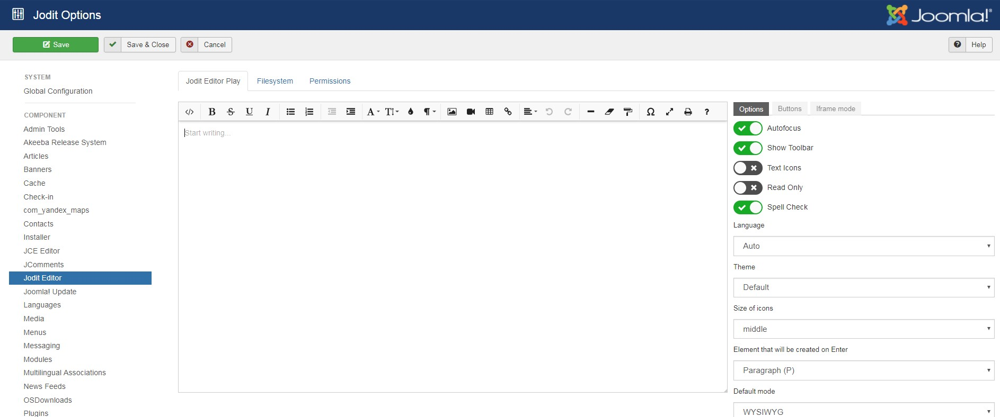
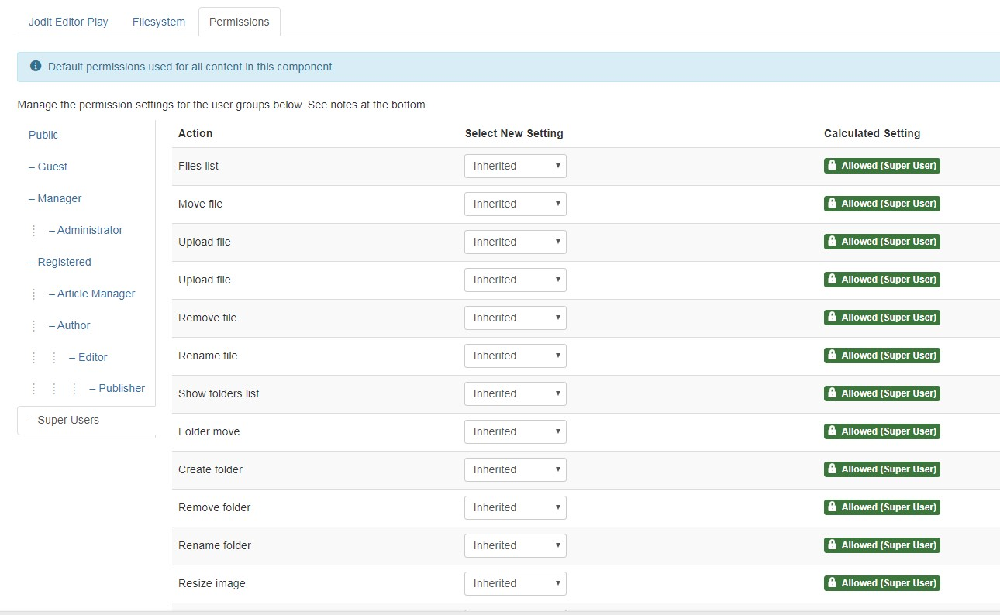
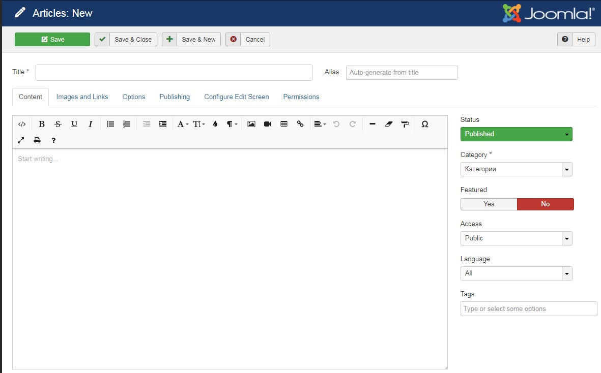
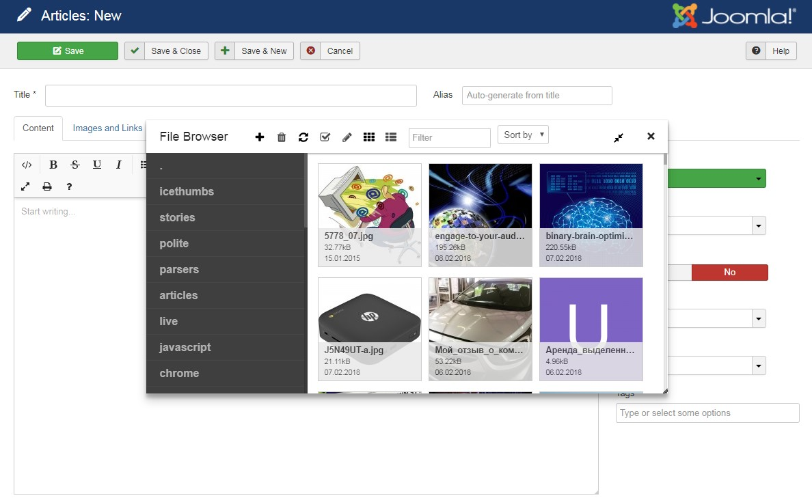

# Jodit Editor for Joomla
Joomla Jodit editor package v.3.2.7

* [Download](https://github.com/jodit/jodit-joomla/raw/master/tmp/pkg_jodit.zip)
* [Jodit](https://xdsoft.net/jodit/)
* [Jodit PlayGround](https://xdsoft.net/jodit/play.html)

## Settings

## Permissions

## Editor

## FileBrowser
